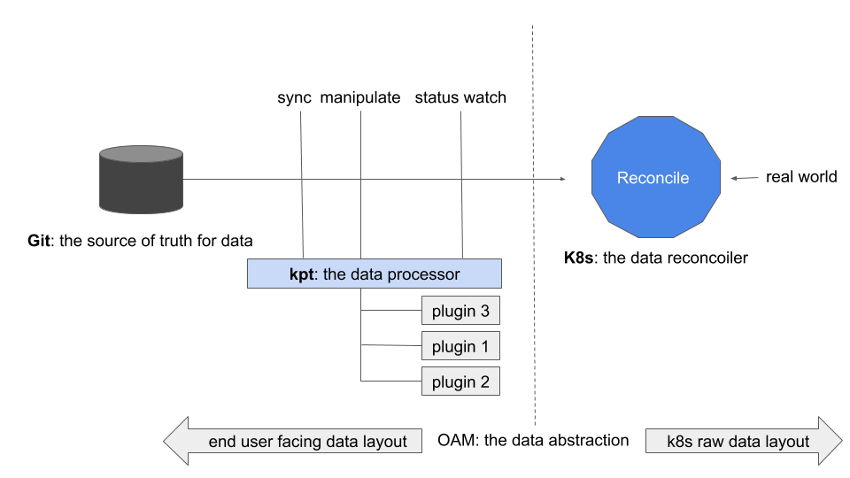

# Managing custom Kubernetes applications with kpt

This guidance will demonstrate how to use kpt to manage custom Kubernetes
applications (i.e. apps defined by CRDs instead of raw Kubernetes workloads).

We will use [KubeVela](https://kubevela.io) to describe the app for
standardization and portability consideration. 
But you are free to use any Custom Resource to describe your application as
well.  

## What is kpt?

Pioneered by [Kubernetes
community](https://twitter.com/bgrant0607/status/1221485437153243137),
Configuration-as-Data emphasizes that "configuration should be treated as data
and leverage pipelines for manipulation and policy enforcement". 
In Kubernetes, Configuration-as-Data approach builds upon the design of the
[Kubernetes resource model
(KRM)](https://github.com/kubernetes/community/blob/master/contributors/design-proposals/architecture/resource-management.md).
As a result, today any resource we applied to Kubernetes is a piece of data that
represents the desired state for certain part of application or infrastructure
in the real system.

With the heart of Configuration-as-Data, a typical Kubernetes native application
management workflow just looks like a "pipeline". See the picture below:



In this workflow, kpt is the manipulator of data. Stored in data source like
Git, the original data (e.g. deployment.yaml) will pass through a pipeline of
kpt functionalities to be manipulated into the desire state step by step. 
For example, `labels` added, `replicas` modified and `image` updated etc. 

## Pre-requisites

* Follow the instructions in the
[installation](https://kubevela.io/docs/install) document to get KubeVela
installed.

## Create App Repository for kpt

kpt directly use GitHub repo as App Repository, so no action needed.

With the help of kpt, we could directly use GitHub Repo as App Repository
without organizing apps in any fixed format.

### Release your application to App Repository

So release your OAM app only needs two steps.

1. Create/Fork a github repo.

2. Commit and push your app.
    ```shell
    git add sampleapp/
    git commit -m "my sampleapp commit"
    git remote add origin git@github.com:<your-account>/<your-app-repo>.git
    git push -u origin master
    ```

### Fetch KubeVela app from remote Repository

Using our [example
repository](https://github.com/oam-dev/samples/tree/master/5.OAM_KPT_Demo/repository/)
for this demo.

You could fetch KubeVel app from remote Repository using [kpt pkg
get](https://googlecontainertools.github.io/kpt/reference/pkg/get/).

#### Command

```shell
kpt pkg get https://github.com/oam-dev/samples.git/5.OAM_KPT_Demo/repository/sampleapp sampleapp
```

#### Output

```output
fetching package /5.OAM_KPT_Demo/repository/sampleapp from https://github.com/oam-dev/samples to sampleapp
```

```shell
➜  kpt tree sampleapp
sampleapp
├── Kptfile
└── appconfig.yaml

0 directories, 3 files
```

### Install sample app

```shell
$ kubectl apply -f sampleapp/
application.core.oam.dev/example-appconfig created
```
Check the underlying Deployment instance generated by OAM.

```shell
$ kubectl get deploy
NAME                                    READY   UP-TO-DATE   AVAILABLE   AGE
example-appconfig-workload-deployment   3/3     3            3           114s
```

### Sync with Remote App Repository

When some changes occurred both local and remote apps, you could sync and merge
with kpt.

For example, we changed our sampleapp and tag it as `v0.1.0`, then our local
sampleapp also is changed.

```shell
kpt pkg update sampleapp@v0.1.0 --strategy=resource-merge
```

Ref to [update
section](https://googlecontainertools.github.io/kpt/guides/consumer/update/#commit-local-changes)
of kpt for more details.


### Parameter Setting

[kpt setters](https://googlecontainertools.github.io/kpt/guides/consumer/set/)
is a powerful feature which naturally matches to the idea of "separate concerns"
design from KubeVela.

In KubeVela, developers can claim certain fields in the application YAML as
"configurable", so in the following workflow, operators (or the platform) will
be allowed to modify these fields.

Now this goal can be easily achieved with help of kpt.

#### Create setter by App Developer

Let's say the developer need to claim two fields as "configurable" for his
application, he can add two kpt setters here:


```shell
$ kpt cfg create-setter sampleapp/ image nginx:1.16.1 --field "image" --description "use to set image for component" --set-by "sampleapp developer"
```

Then the app operator could see which parameters are available in this component like below:

```shell
$ kpt cfg list-setters sampleapp/
  NAME              VALUE               SET BY                   DESCRIPTION             COUNT
  image           nginx:1.16.1        sampleapp developer   use to set image for component   1
  instance-name   example-component   sampleapp developer   use to set an instance name      1
```

It's very clear and easy to understand.

#### Set Value by App Operator

Then the application operator could set `instance-name` with a new name like this:

```shell
$ kpt cfg set sampleapp/ instance-name test-component
set 1 fields
```

Check the component and you will find the instane name has been changed.

```shell
$ cat sampleapp/component.yaml
apiVersion: core.oam.dev/v1alpha2
kind: Component
metadata:
  name: test-component # {"$ref":"#/definitions/io.k8s.cli.setters.instance-name"}
spec:
  workload:
    apiVersion: core.oam.dev/v1alpha2
    kind: ContainerizedWorkload
    spec:
      containers:
      - name: my-nginx
        image: nginx:1.16.1 # {"$ref":"#/definitions/io.k8s.cli.setters.image"}
        ...
```

### App Overview

With kpt, you could see an overview of your App.

```shell
$ kpt cfg count sampleapp
ApplicationConfiguration: 1
Component: 1
```

So in the sampleapp, we have one ApplicationConfiguration and one Component.

### Live apply

kpt includes the next-generation **apply** commands developed out of the Kubernetes [cli-utils](https://github.com/kubernetes-sigs/cli-utils) repository as the [`kpt live apply`](https://googlecontainertools.github.io/kpt/reference/live/apply) command.

This means with `kpt live apply` command, we could wait for the controller reconcile.

```shell
$ kpt live init sampleapp
Initialized: ../sampleapp/grouping-object-template.yaml
```

```shell
$ kpt live apply sampleapp --wait-for-reconcile
configmap/inventory-9ac03a44 unchanged
applicationconfiguration.core.oam.dev/example-appconfig created
component.core.oam.dev/example-component created
3 resource(s) applied. 2 created, 1 unchanged, 0 configured
configmap/inventory-9ac03a44 is Current: Resource is always ready
applicationconfiguration.core.oam.dev/example-appconfig is NotFound: Resource not found
component.core.oam.dev/example-component is NotFound: Resource not found
applicationconfiguration.core.oam.dev/example-appconfig is Current: Resource is current
component.core.oam.dev/example-component is Current: Resource is current
all resources has reached the Current status
0 resource(s) pruned
```

Happly building OAM apps with kpt!
